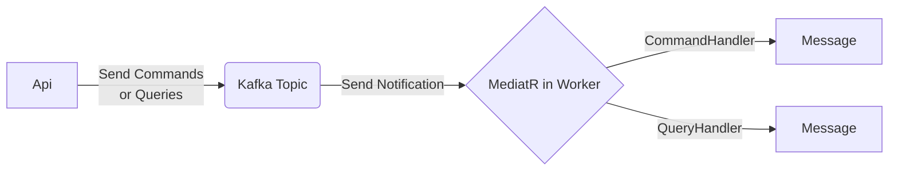
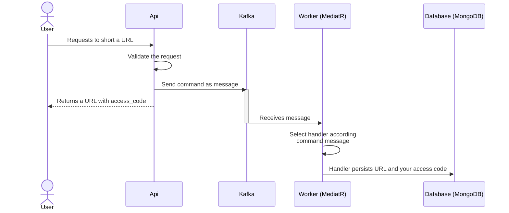
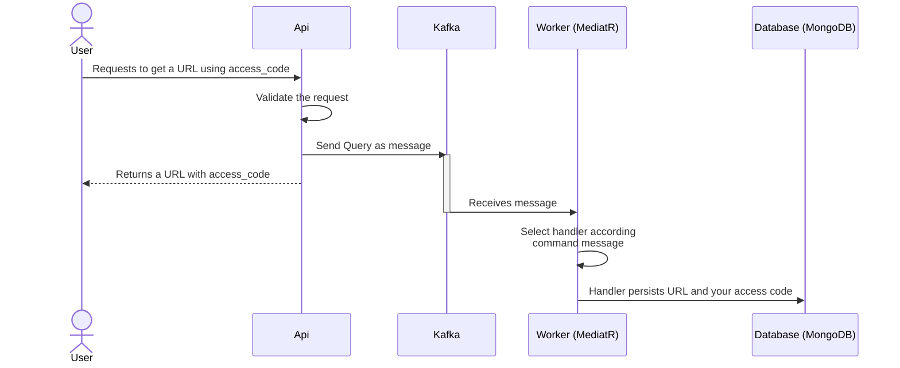

# Sample 02 - CQRS and Kafka with Url Shortener Project

This sample project aims to demonstrate: *the concepts of Command Query Segregation of Responsibility, or CQRS, integration Kafka/.Net* through a microservice project called a URL Shortener (the one you may have seen in several tutorials).

The sample is simple and consists of a Command to short a requested URL and a Query to fetch the shortened link in a NoSQL (MongoDB) database.

In Api, the Controller has endpoints that receives a URL as parameter or get a URL by a code, after send a Command or a Query as message to Kafka topic. The Worker receives the message and calls MediatR to get a especific Handler that message.

## Basic diagrams (Make in Mermaid.js)
### Flow diagram

### Sequence Diagrams
**Send Command to Generate URL Shortened**

**Send Query to Get real URL using  a access_code**

---

## How to Run

1. Install Docker and Docker-Compose your machine;
2. Execute the docker-compose.yaml file to Run project;
3. Open your favorite browser in [http://localhost:8000/swagger];

