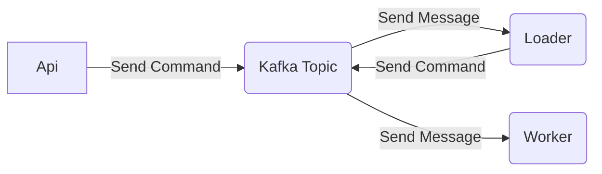

# Sample 02 - CQRS and Kafka with Score Calculator Project

This sample project aims to demonstrate: *the concepts of Command Query Segregation of Responsibility, or CQRS, integration Kafka/.Net* through a microservice project called a Score Calculator.

The sample is simple and consists of Commands to calculate score to many clients based your debit values or cancel the calculate (using Compensating Transactions by Saga Pattern).

In Api, the Controller has endpoints that initiate a calculate, get it progress and cancel it progress. Those actions always make sending a Command as message to Kafka topic. 

The Loader project focuses on delegates actions to Worker like: 
-  Generate customer data and send Command message for each customer to Worker calculates the score.
- Receive Command to cancel a calculation process and uses a Compensating Transaction to finish it.

The Worker project focuses on action to calculate score: 
-  Receive Command to calculate score for customer and persists it in the database.
- Receive Command as Compensating Transaction to cancel a calculation process and remove all scores calculated in database.

This project uses a **JSON schema** from *Schema-Registry* to keep a message format compatible between apps.

## Basic diagrams (Make in Mermaid.js)
### Flow diagram

### Sequence Diagrams
**Send Command to Start Calculate Score flow**

**Send Command to Cancel a calculate score progression by a id**

---

## How to Run

### Before Run the project

- Run docker-compose.yml in **/docker-kafka** directory 
- Run the shell script in **/docker-kafka/schemas** directory to create necessary schema to running this project!

### To Run this project

1. Install Docker and Docker-Compose your machine;
2. Execute the docker-compose.yaml file to Run project;
3. Open your favorite browser in [http://localhost:8000/swagger];

